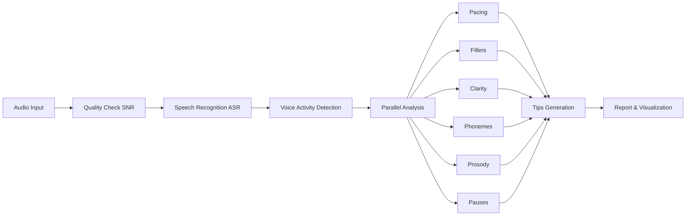

# 🎤 Echo - Speech Analysis

**Instant accent & clarity feedback for speech clips**

Echo provides real-time analysis of speech patterns, pronunciation, pacing, and fluency. Perfect for presentations, interviews, language learning, and daily communication improvement.

## ✨ Features

### 🎯 Comprehensive Analysis
- **Speech Clarity** - ASR confidence + pronunciation assessment
- **Speaking Pace** - Words per minute with target range recommendations  
- **Filler Detection** - "Um", "uh", "like" and other disfluencies
- **Pronunciation Risks** - Accent pattern analysis for TH, R/L, W/V, ZH, NG sounds
- **Prosody Analysis** - Pitch stability, energy control, uptalk detection
- **Pause Classification** - Hesitation vs. rhetorical pause identification
- **Audio Quality Check** - SNR pre-flight assessment

### 🚀 Three Ways to Use
- **Web Interface** - Clean Gradio UI for interactive analysis
- **REST API** - FastAPI backend for integration
- **Command Line** - Batch processing and automation

### 🏠 Privacy-First Design
- **Offline-first** - All processing happens on your device
- **No cloud dependencies** - Works without internet after setup
- **Local storage** - Session history saved locally
- **Optional models** - Heavy models only if internet/GPU available

### 📊 Rich Reporting
- **Interactive dashboards** - Real-time visualizations
- **PDF reports** - Professional analysis summaries
- **Session history** - Track progress over time
- **Practice mode** - Targeted phoneme drill feedback

## 🚀 90-Second Quickstart

```bash
# 1. Install dependencies
pip install -r requirements.txt

# 2. Setup models (one-time, ~100MB download)
python scripts/setup_models.py

# 3. Launch web interface
python webui/app.py
```

Open http://localhost:7860 and try the **Demo** button or upload a 20-60 second audio clip!

## 📋 Requirements

- **Python** 3.10+
- **Audio formats**: WAV, MP3, WEBM, M4A, FLAC
- **Duration**: Up to 90 seconds per clip
- **Hardware**: CPU-only laptop (2GB RAM recommended)

## 📦 Installation

### Option 1: Standard Setup
```bash
git clone https://github.com/your-username/echo.git
cd echo
pip install -r requirements.txt
python scripts/setup_models.py
```

### Option 2: Development Setup
```bash
git clone https://github.com/your-username/echo.git
cd echo
pip install -e ".[dev]"
python scripts/setup_models.py
make test
```

### Option 3: Docker
```bash
docker build -t echo:latest .
docker run -p 7860:7860 echo:latest
```

## 🎯 Usage Examples

### Web Interface
```bash
python webui/app.py
# Open http://localhost:7860
# Click "Try Demo" or upload audio
```

### Command Line
```bash
# Basic analysis
python -m cli.echo_cli recording.wav

# Full report with verbose output
python -m cli.echo_cli speech.mp3 --report --verbose --mode Presentation

# JSON output for scripting
python -m cli.echo_cli audio.wav --format json --output results.json

# Save session for later review
python -m cli.echo_cli presentation.wav --save-session --session-name "Practice Run"
```

### REST API
```bash
# Start API server
python -m app.main
# Server runs at http://localhost:8000

# Check audio quality
curl -X POST "http://localhost:8000/snr_check" -F "audio_file=@speech.wav"

# Full analysis
curl -X POST "http://localhost:8000/analyze" -F "audio_file=@speech.wav"

# Phoneme drill practice  
curl -X POST "http://localhost:8000/drill_analyze" -F "audio_file=@drill.wav" -F "phoneme_group=TH"
```

## 📊 Analysis Pipeline



## 🎛️ Configuration

Edit `config.yaml` or use environment variables:

```yaml
# Audio settings
audio:
  max_duration_seconds: 90
  sample_rate: 16000

# Analysis thresholds
analysis:
  snr_db_threshold: 20.0
  wpm:
    target_range: [140, 160]
  prosody:
    uptalk_threshold: 0.18
```

Key environment variables:
- `ECHO_PORT=7860` - Web interface port
- `SNR_DB_THRESHOLD=20` - Audio quality threshold
- `FASTER_WHISPER_MODEL=small.en` - ASR model size
- `VIDEO_ENABLED=false` - Enable video analysis (experimental)

## 📈 Metric Definitions

### Overall Score (0-100)
Weighted average of clarity, pacing, fluency, and prosody scores.

### Speech Clarity (0-100)
- **70% ASR confidence** - How confidently words were recognized
- **30% text consistency** - Internal consistency checks via WER

### Speaking Pace (WPM)
- **Target range**: 140-160 WPM for presentations
- **Slow threshold**: <120 WPM
- **Fast threshold**: >180 WPM
- **Context-aware**: Different targets for Interview/Casual modes

### Filler Assessment
- **Excellent**: ≤1 filler/minute
- **Good**: ≤2 fillers/minute  
- **Moderate**: ≤4 fillers/minute
- **High**: >4 fillers/minute

### Pronunciation Risk (0-100%)
Risk scores for challenging sound groups:
- **TH sounds**: /θ, ð/ (think, this)
- **R/L distinction**: /r, l/ (red, led)
- **W/V sounds**: /w, v/ (wine, vine)
- **ZH sounds**: /ʒ/ (measure, pleasure)
- **NG endings**: /ŋ/ (running, working)

### Prosody Analysis
- **Pitch stability**: Coefficient of variation in F0
- **Energy stability**: RMS energy consistency
- **Uptalk detection**: Rising intonation on statements (>18% pitch increase)

### Pause Classification
- **Hesitation pauses**: Near fillers or mid-clause breaks (reduce these)
- **Rhetorical pauses**: Aligned with punctuation, ≥1.0s (good for emphasis)

### Audio Quality (SNR)
- **Excellent**: >25 dB
- **Good**: 20-25 dB  
- **Acceptable**: 15-20 dB
- **Poor**: <15 dB (analysis may be inaccurate)

## 🎯 Practice Mode

Target specific sound groups with instant feedback:

### TH Sounds (/θ, ð/)
**Practice phrase**: "The thirty-three thieves thought they thrilled the throne"
- Place tongue lightly between teeth
- Feel airflow for voiceless /θ/ sounds
- Add voice for /ð/ in "this", "that"

### R/L Distinction
**Practice phrase**: "Really red roses are rarely real"  
- R: Curl tongue back, don't touch roof of mouth
- L: Touch tongue tip to ridge behind upper teeth

### W/V Sounds
**Practice phrase**: "Very vivid videos were viewed by visitors"
- V: Upper teeth touch lower lip lightly
- W: Round lips, no teeth contact

### ZH Sounds (/ʒ/)
**Practice phrase**: "Measure the pleasure of leisure and treasure"
- Like "sh" but with vocal cord vibration
- Feel the buzz in your throat

### NG Endings (/ŋ/)
**Practice phrase**: "Running, jumping, thinking, working, singing"
- Keep tongue back, don't add "k" sound
- Sound comes from back of mouth

## 🏗️ Architecture

### Core Components
- **ASR Layer**: faster-whisper (primary), Vosk (fallback), optional WhisperX
- **Audio Processing**: librosa + webrtcvad for signal analysis
- **Analysis Engines**: Modular components for each metric type
- **Web Interface**: Gradio for rapid prototyping and demos
- **API Backend**: FastAPI for production integration

### Model Stack
```
┌─────────────────────────────────────────┐
│                Frontend                 │
├─────────────────────────────────────────┤
│ Gradio UI │ REST API │ CLI Interface   │
├─────────────────────────────────────────┤
│             Analysis Layer              │
├─────────────────┬───────────────────────┤
│ Pacing │ Fillers │ Clarity │ Phonemes  │
│ Prosody │ Pauses │ Quality │ Tips      │
├─────────────────┴───────────────────────┤
│              Audio Processing           │
├─────────────────────────────────────────┤
│  VAD │ Preprocessing │ Feature Extract  │
├─────────────────────────────────────────┤
│              Model Layer                │
├─────────────────────────────────────────┤
│ faster-whisper │ Vosk │ G2P │ librosa  │
└─────────────────────────────────────────┘
```

### Performance Characteristics
- **Processing Speed**: 0.1-0.3x real-time on CPU (i.e., 30s audio → 3-9s processing)
- **Memory Usage**: ~500MB working set for small models
- **Model Sizes**: 
  - faster-whisper small.en: ~244MB
  - Vosk small English: ~40MB
  - G2P English: ~10MB
- **Accuracy**: >90% for native English speakers with clear audio (SNR >20dB)

## 🐛 Troubleshooting

### Common Issues

**"No speech detected"**
- Check microphone permissions
- Ensure audio has speech content
- Try increasing recording volume
- Check supported file formats

**"High background noise detected"**  
- Record in quieter environment
- Use headset microphone
- Move closer to microphone
- Enable noise cancellation if available

**"ASR engine failed"**
- Run `python scripts/setup_models.py --check-deps`
- Install missing dependencies: `pip install -r requirements.txt`
- For macOS: `brew install ffmpeg portaudio`
- For Ubuntu: `sudo apt-get install ffmpeg libportaudio2`

**Slow processing**
- Use smaller audio files (<60s)
- Check CPU usage during analysis
- Close other resource-intensive applications
- Consider using smaller ASR model size

**Module import errors**
- Verify virtual environment activation
- Check Python version (3.10+ required)
- Reinstall with `pip install -r requirements.txt --force-reinstall`

### Performance Optimization

**For faster processing:**
```bash
# Use smaller models
export FASTER_WHISPER_MODEL=tiny.en

# Disable optional features  
export VIDEO_ENABLED=false
export WHISPERX_ENABLED=false

# Reduce audio quality for speed
# (in config.yaml)
audio:
  sample_rate: 8000  # Lower quality, faster processing
```

**For better accuracy:**
```bash
# Use larger models (if available)
export FASTER_WHISPER_MODEL=base.en

# Higher quality audio processing
# (in config.yaml)
audio:
  sample_rate: 16000
analysis:
  snr_db_threshold: 25
```

## 🧪 Testing

```bash
# Run test suite
make test

# Test specific component
python -m pytest tests/test_pacing.py -v

# Test with sample audio
python -m cli.echo_cli assets/sample_audio/demo.wav --verbose

# Benchmark performance
python scripts/benchmark.py assets/sample_audio/demo.wav
```

## 🤝 Contributing

We welcome contributions! Please see our [Contributing Guidelines](CONTRIBUTING.md).

### Development Setup
```bash
git clone https://github.com/your-username/echo.git
cd echo
pip install -e ".[dev]"
pre-commit install
make test
```

### Code Quality
- **Formatting**: Black, isort
- **Linting**: flake8, mypy  
- **Testing**: pytest with >80% coverage
- **Documentation**: Comprehensive docstrings

## 🛣️ Roadmap

### Current (v1.0)
- ✅ Core speech analysis pipeline
- ✅ Web interface with real-time feedback
- ✅ CLI for batch processing
- ✅ REST API for integration
- ✅ PDF report generation
- ✅ Practice mode for pronunciation

### Near-term (v1.1-1.2)
- 🔄 Video analysis (gaze tracking, gesture detection)
- 🔄 Multi-language support (Spanish, French, German)
- 🔄 Advanced prosody (stress patterns, rhythm analysis)
- 🔄 Real-time streaming analysis
- 🔄 Custom model training

### Long-term (v2.0+)
- 🔮 Speaker adaptation and personalization
- 🔮 Conversation analysis (multi-speaker)
- 🔮 Emotion and sentiment detection
- 🔮 Integration with presentation software
- 🔮 Mobile app development

## 📄 License

This project is licensed under the MIT License - see the [LICENSE](LICENSE) file for details.

## 🙏 Acknowledgments

- **faster-whisper** - High-performance ASR inference
- **Vosk** - Offline speech recognition toolkit
- **librosa** - Audio analysis library
- **Gradio** - Rapid ML interface development
- **G2P-en** - English grapheme-to-phoneme conversion
- **webrtcvad** - Voice activity detection

## 📞 Support

- **Documentation**: [Full docs](docs/)
- **Issues**: [GitHub Issues](https://github.com/your-username/echo/issues)
- **Discussions**: [GitHub Discussions](https://github.com/your-username/echo/discussions)
- **Email**: echo-support@example.com

---

**Made with ❤️ by the Echo team**

*Empowering clear communication through technology*